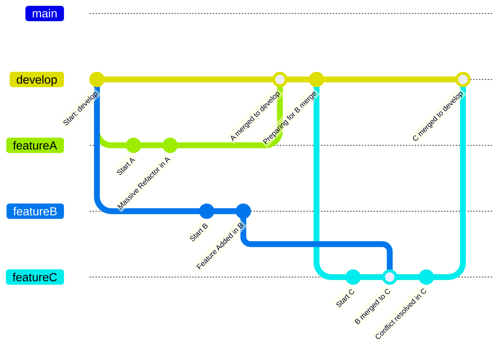

## 🔍 상황 요약: 리팩토링이 부른 의도하지 않은 충돌

하나의 프로젝트에서 `develop` 브랜치로부터 `feature/A`와 `feature/B`가 분기되었다.

- `feature/A`: 전역적인 리팩토링 및 테스트 코드 개선
- `feature/B`: 소규모 기능 추가

두 브랜치는 동시에 작업이 진행되었고, 먼저 완료된 `A`가 `develop`에 병합되었다. 그 이후 `B`를 병합하려는 시점에 **예상보다 훨씬 많은 충돌**이 발생하면서 문제가 시작됐다.

## 🛠 A 브랜치에서 무슨 일이 있었나?

`feature/A`는 단순한 기능 추가가 아닌 **프로젝트 전반에 영향을 주는 테스트 코드 리팩토링** 작업이었다. 주요 작업은 다음과 같다.

- 빌더 패턴을 활용한 Fixture 개선
- 중복 생성 메서드 제거 및 유연한 객체 생성
- 저장 로직과 도메인 생성 로직의 분리
- 가독성 향상 및 테스트 목적 분리
- 파일 구조, 클래스 이름, 파일명 변경 및 신규 파일 추가

> 자세한 설명은 [이 글](https://burningfalls.github.io/java/improving-fixture-design-for-efficient-test-data-management/)을 참고하세요.

이처럼 **전체적인 파일 구조가 바뀌었기 때문에**, 기존 구조를 기반으로 작업했던 `B`와는 완전히 다른 기반이 되어버렸다.

## 🧨 문제 발생: B의 develop 병합 충돌

`feature/B`는 소규모의 기능 수정만을 담고 있었지만, `develop`에 `A`가 병합되면서 전체적인 구조가 달라졌기 때문에 많은 충돌이 발생했다.

특히 다음과 같은 문제가 있었다:

- 동일한 파일에 대한 양쪽의 수정 충돌
- 파일/클래스 이름 변경에 따른 경로 충돌
- 삭제/이동된 파일로 인한 merge 충돌

## 🧭 해결 전략: 중간 브랜치 C의 도입

복잡한 충돌을 직접 `develop`에서 처리하기보다, **새로운 중간 브랜치 `C`를 생성하여 충돌을 선제적으로 해결**하는 전략을 선택했다.

### 💡 전략 요약

1. `develop`을 기준으로 새로운 브랜치 `feature/C` 생성
2. `feature/B`를 `feature/C`에 병합
3. `C`에서 충돌을 해결
4. `C`를 최종적으로 `develop`에 병합

👉 아래는 전체 흐름을 시각화한 브랜치 병합 다이어그램입니다:




### 📈 브랜치 흐름 시각화

```plaintext
초기 브랜치 분기
develop
   ├── feature/A
   └── feature/B

A 병합 이후
feature/A ─▶ develop (구조 전체 변경)
                    \
                     \
                   feature/C (develop 기준에서 새로 생성)
                        \
                         └─── Merge feature/B
                                  ↓
                           충돌 해결 후 C를 develop에 병합
```

## ✅ 병합 전략의 효과와 실질적인 이점

이번처럼 충돌이 예고된 상황에서 **중간 브랜치 `C`를 활용한 병합 조율 전략**은 다음과 같은 실질적인 이점을 제공했다.

🔸 충돌의 영향 범위를 좁힐 수 있다.
- `feature/B`는 소규모였기 때문에, 최신 구조를 반영한 중간 브랜치에서 충돌을 먼저 처리하는 방식이 **전체 conflict 범위를 대폭 축소**시켰다.
- 병합 충돌을 중간 브랜치에서 해결했기 때문에, `develop` 브랜치에는 충돌이나 오류가 직접 발생하지 않아 **안정적인 상태를 유지**할 수 있었다.

🔸 병합 히스토리를 명확하게 유지할 수 있다.
- `feature/B` 병합과 그에 따른 충돌 해결 기록이 모두 `feature/C`에 담기기 때문에, **`develop` 브랜치에는 병합 완료된 결과만 반영**된다.
- 리뷰 관점에서도 변경 이력이 분리되어 있어, 충돌 해결 내용과 기능 변경 내용을 분리해 파악하기가 수월하다.

🔸 팀원 간 협업이 깔끔해진다.
- 충돌을 `develop`에서 처리하지 않음으로써 **공용 브랜치에서의 혼란을 예방**할 수 있다.
- 리뷰 과정에서도 혼동이 줄고, 중간 브랜치에서 충돌 해결 후 `develop`에는 안정된 변경만 머지되므로 심리적 부담도 감소한다.

🔸 작업 완료 타이밍과 무관하게 유연한 병합이 가능하다.
- `A`와 `B`의 작업이 겹쳤지만, 구조 변경이 먼저 들어갔을 때 `B`를 단순히 머지하는 방식은 어렵다. 이럴 땐 `C`를 통해 **병합 순서를 조정하면서 유연하게 개발 흐름을 조정**할 수 있다.

## 🔒 대규모 브랜치 작업 시 충돌을 사전에 방지하려면?

`feature/A`에서 대규모 변경이 이루어진 후, 이를 먼저 병합한 `develop`에 `feature/B`를 병합하려 하자 충돌이 발생했다. 겪고 보니 이런 상황은 얼마든지 다시 일어날 수 있고, 미리 준비하면 충분히 줄일 수도 있다는 생각이 들었다.

그래서 **대규모 브랜치 작업 시 merge conflict 가능성을 줄이기 위한 네 가지 전략**을 정리해봤다.

🔸 기능 단위로 브랜치를 쪼개고 작은 PR 단위로 작업하기
- 브랜치가 커질수록 병합 리스크는 기하급수적으로 증가한다.
- 기능 단위, 모듈 단위로 작업 범위를 쪼개고 PR을 작게 유지하면, 충돌을 예방할 수 있다.
- 예: `A` 브랜치도 "Fixture 구조 개선", "테스트 리팩토링", "도메인 객체 저장 로직 분리" 등으로 분리 가능했다면 충돌 여지를 줄일 수 있었을 것이다.

🔸 `develop`과 주기적인 `rebase` 또는 병합 유지
- 오랜 기간 develop과 동기화하지 않으면 충돌은 누적되며, 나중에 한꺼번에 병합할 때 문제가 많이 생긴다.
- `git pull --rebase origin develop` 같은 커맨드를 일정 주기로 사용해 최신 구조를 반영하고, 충돌을 점진적으로 처리하는 습관을 들여야 한다. (이 명령어는 현재 브랜치를 최신 `develop` 위로 재배치하면서 충돌을 조기에 발견하고 해결할 수 있도록 도와주는 명령이다.)

🔸 구조 변경이 예상될 경우, 관련 `feature` 브랜치 개발자와 조기 협의
- 동일 파일이나 유사한 기능을 다루는 브랜치가 있다면, 구조 변경 전/후로 그 내용을 공유하고 병합 계획을 조율할 필요가 있다.
- 변경 파일 알림을 자동화하거나, Slack과 연동하여 특정 디렉토리 변경 시 알림을 보내는 것도 효과적이다.

🔸 큰 변경 브랜치는 먼저 병합
- 대규모 변경은 전체 기반을 흔들기 때문에, 작은 브랜치보다 우선적으로 병합되는 것이 안전하다.
- 반대로 대형 브랜치가 너무 늦게 병합되면, 그 사이 병합된 다른 브랜치와의 충돌이 복잡해진다.

이러한 전략을 실제로 적용하면, 대규모 변경으로 인해 발생하는 merge conflict를 **방어적으로 예방**할 수 있고, 병합 과정에서 소요되는 비용도 대폭 줄일 수 있다.

## 🎯 핵심 교훈과 정리

이번 병합 사례에서 얻은 실질적인 교훈은 다음과 같다:

🔸 **브랜치 병합은 단순한 순서 문제가 아니다.**
* 변경 규모와 구조 변화 여부, 병행 작업의 상태를 고려한 **전략적인 병합 판단**이 필요하다.

🔸 **대규모 리팩토링은 '단순히 먼저 병합하면 끝'이 아니다.**
* 후속 브랜치에 미치는 영향력을 예측하고, 그에 대한 대응책까지 설계한 뒤 merge 계획을 세워야 한다.

🔸 **중간 브랜치를 활용한 병합 전략은 충분히 유효하고 재사용 가능한 패턴이다.**
* 단발성 해결이 아니라, 협업 시 여러 브랜치가 엇갈리는 상황에서 **갈등을 안전하게 흡수하고 정리하는 구조적인 방법**이 된다.

🔸 **충돌은 피할 수 없어도, 예측하고 제어할 수 있다.**
* 앞서 언급한 전략들(브랜치 분할, 주기적 rebase, 사전 협의, 병합 우선순위 설정)을 통해 **병합에 드는 리소스를 사전에 줄이는 설계가 가능하다.**
