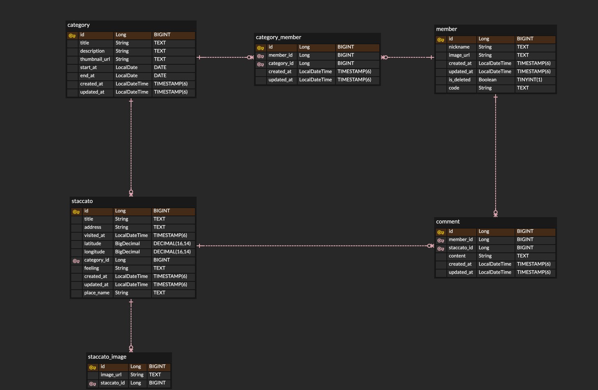

👉 [스타카토 서비스 소개 홈페이지](https://staccato.kr/)

우리 팀은 장소 기반의 추억을 기록하고 공유하는 서비스인 **Staccato**를 만들고 있습니다. 
이 서비스에서 **하나의 장소에서의 경험과 감정, 이미지, 소통을 통합한 단위**를 "**스타카토(Staccato)**"라고 정의합니다.

스타카토는 다음의 정보를 포함합니다:
- 장소의 제목
- 주소
- 방문 시각
- 그곳에서 느낀 감정
- 위치 좌표
- 여러 장의 사진
- 참여자들의 댓글

이러한 스타카토 여러 개를 묶어 하나의 **카테고리(category)**로 구성함으로써, "2024 제주 여행", "고등학교 동창 모임" 같은 테마별 기록 정리가 가능하게 설계했습니다.

이 글에서는 이 서비스를 어떻게 도메인으로 구조화했는지를 **ERD**(Entity-Relationship Diagram)를 통해 소개합니다.

## 📷 ERD 한눈에 보기

우리 서비스의 핵심 테이블 구조입니다.

## 📦 주요 도메인 설명

### 1. member: 사용자 정보

* 설명: 서비스에 가입한 사용자의 기본 정보를 담는 테이블입니다.
* 주요 필드
  * `nickname`, `image_url`: 사용자 프로필 정보
  * `is_deleted`: 탈퇴 여부 플래그
  * `code`: 사용자 식별 코드

### 2. category: 스타카토 묶음

* 설명: 여러 개의 스타카토를 하나로 묶는 단위입니다.
* 주요 필드
  * `title`, `description`: 카테고리 제목과 설명
  * `thumbnail_url`: 카테고리 썸네일 이미지
  * `start_at`, `end_at`: 카테고리의 시작과 종료 날짜

### 3. category_member: 사용자-카테고리 연결 테이블

* 설명: 사용자와 카테고리를 연결하는 중간 테이블입니다.
* 주요 필드
  * `member_id`: 참여 사용자 → **member.id** (외래 키)
  * `category_id`: 대상 카테고리 → **category.id** (외래 키)
* 관계
  * 다대다(M:N): 하나의 사용자가 여러 카테고리에 참여 가능, 하나의 카테고리에 여러 사용자가 참여 가능

### 4. staccato: 기록의 핵심 단위

* 설명: 장소 기반의 기록을 관리하는 핵심 테이블로, 텍스트, 위치, 감정, 시간, 이미지, 댓글 등 다양한 정보가 연결됩니다.
* 주요 필드
  * `title`, `address`, `place_name`: 장소 정보
  * `latitude`, `longtitude`: 정밀 위치 좌표
  * `feeling`: 감정 표현
  * `visited_at`: 방문 시간
  * `category_id`: 소속 카테고리 → **category_id** (외래 키)
* 관계
  * 1:N (category → staccato): 하나의 카테고리에 여러 스타카토가 속함

### 5. staccato_image: 스타카토에 포함된 사진

* 설명: 하나의 staccato에 여러 장의 이미지를 첨부할 수 있도록 구성된 테이블입니다.
* 주요 필드
  * `image_url`: 스타카토 이미지
  * `staccato_id`: 참조 대상 스타카토 → **staccato.id** (외래 키)
* 관계
  * 1:N (staccato → staccato_image): 하나의 스타카토는 여러 이미지를 가질 수 있음

### 6. comment: 스타카토에 대한 댓글

* 설명: 사용자가 스타카토에 대해 남긴 메시지를 저장하는 테이블입니다.
* 주요 필드
  * `content`: 댓글 내용
  * `member_id`: 작성자 → **member.id** (외래 키)
  * `staccato_id`: 대상 스타카토 → **staccato.id** (외래 키)
* 관계
  * N:1 (comment -> staccato): 하나의 스타카토에 여러 댓글이 달릴 수 있음
  * N:1 (comment -> member): 하나의 사용자가 여러 댓글을 남길 수 있음
